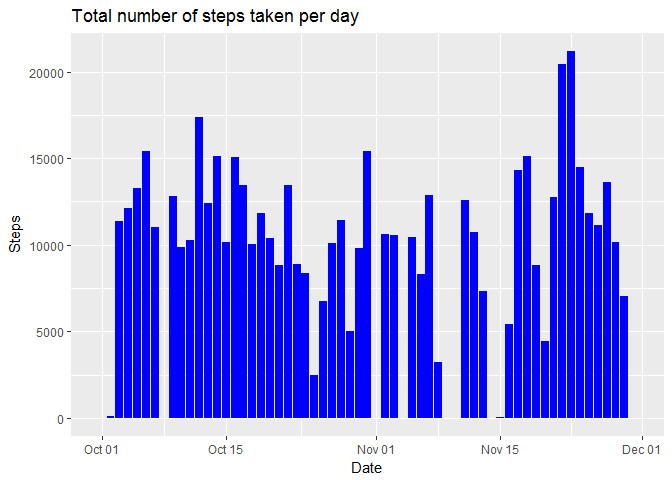
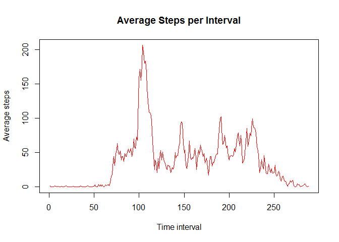
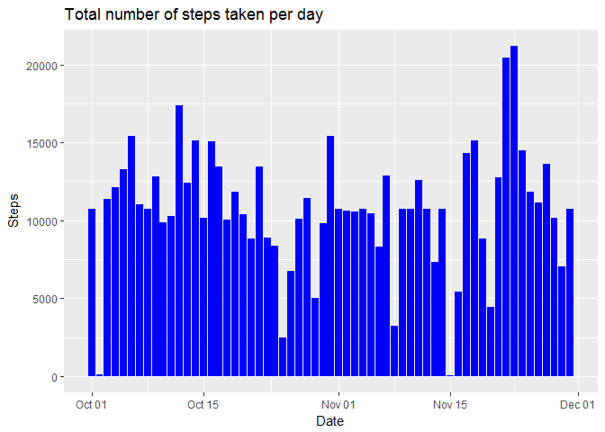
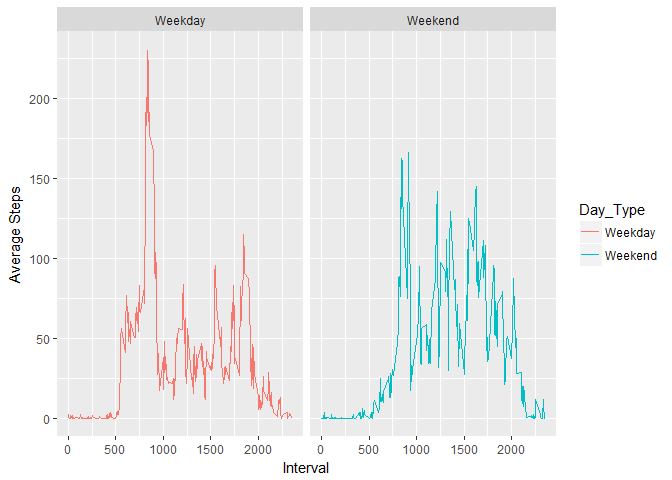

Analysing Activity monitoring data
==================================

Author:-Rajib Kar
-----------------

Introduction
------------

It is now possible to collect a large amount of data about personal
movement using activity monitoring devices such as a Fitbit, Nike
Fuelband, or Jawbone Up. These type of devices are part of the
"quantified self" movement - a group of enthusiasts who take
measurements about themselves regularly to improve their health, to find
patterns in their behavior, or because they are tech geeks. But these
data remain under-utilized both because the raw data are hard to obtain
and there is a lack of statistical methods and software for processing
and interpreting the data.

This assignment makes use of data from a personal activity monitoring
device. This device collects data at 5 minute intervals through out the
day. The data consists of two months of data from an anonymous
individual collected during the months of October and November, 2012 and
include the number of steps taken in 5 minute intervals each day.

Data
----

The variables included in this dataset are:

Steps: Number of steps taking in a 5-minute interval.

Date: The date on which the measurement was taken in YYYY-MM-DD format.

Interval: Identifier for the 5-minute interval in which measurement was
taken.

Questions
---------

1.What is mean total number of steps taken per day?

2.What is the average daily activity pattern?

3.Are there differences in activity patterns between weekdays and
weekends?

Loading the data
----------------

    download.file(url = "https://d396qusza40orc.cloudfront.net/repdata%2Fdata%2Factivity.zip",destfile = "Steps.zip")
    unzip("Steps.zip")
    act<-read.csv("activity.csv")

Calculate the total number of steps taken per day.
--------------------------------------------------

    library(dplyr)

    ## 
    ## Attaching package: 'dplyr'

    ## The following objects are masked from 'package:stats':
    ## 
    ##     filter, lag

    ## The following objects are masked from 'package:base':
    ## 
    ##     intersect, setdiff, setequal, union

    act$date<-as.Date(as.character(act$date),"%Y-%m-%d")

    act_total_steps<-act%>%group_by(date)%>%summarise(total_steps=sum(steps,na.rm=TRUE))

    print(act_total_steps)

    ## # A tibble: 61 × 2
    ##          date total_steps
    ##        <date>       <int>
    ## 1  2012-10-01           0
    ## 2  2012-10-02         126
    ## 3  2012-10-03       11352
    ## 4  2012-10-04       12116
    ## 5  2012-10-05       13294
    ## 6  2012-10-06       15420
    ## 7  2012-10-07       11015
    ## 8  2012-10-08           0
    ## 9  2012-10-09       12811
    ## 10 2012-10-10        9900
    ## # ... with 51 more rows

Making Histogram
----------------

    options(warn=-1)
    library(ggplot2)
    ggplot(act_total_steps,aes(x=date,y=total_steps))+geom_histogram(stat = "identity",fill="blue")+ggtitle("Total number of steps taken per day") + 
      xlab("Date") + 
      ylab("Steps")

The mean and median of the total number of steps taken each day.
----------------------------------------------------------------

    library(dplyr)

    act_total_steps<-act%>%group_by(date)%>%summarise(total_steps=sum(steps,na.rm=TRUE))

    mean(act_total_steps$total_steps)

    ## [1] 9354.23

    median(act_total_steps$total_steps)

    ## [1] 10395

Plotting The activity Pattern Per Day
-------------------------------------

    act_avg_steps<-act%>%group_by(interval)%>%summarise(avg_steps=round(mean(steps,na.rm=TRUE)))

    with(act_avg_steps,plot(x=c(1:288),y=avg_steps,type = "l",col="red",xlab = "Time interval",ylab = "Average steps",main ="Average Steps per Interval" ))

Imputing missing values
-----------------------

total number of missing values

    table(is.na(act$steps))

    ## 
    ## FALSE  TRUE 
    ## 15264  2304

All of the missing values are filled in with mean value for that 5-minute interval.
-----------------------------------------------------------------------------------

    act_new<-act

    for(i in 1:nrow(act_new))
    {
     if(is.na(act_new[i,]$steps))
     {
       int<-act_new[i,]$interval
       act_new[i,]$steps<-subset(act_avg_steps,interval==int)$avg_steps
     }
    }
    table(is.na(act_new$steps))

    ## 
    ## FALSE 
    ## 17568

Making Histogram after handLing the missing values
--------------------------------------------------

    options(warn=-1)
    library(ggplot2)
    library(dplyr)

    act_total_steps_new<-act_new%>%group_by(date)%>%summarise(total_steps=sum(steps,na.rm=TRUE))

    ggplot(act_total_steps_new,aes(x=date,y=total_steps))+geom_histogram(stat = "identity",fill="blue")+ggtitle("Total number of steps taken per day") + 
      xlab("Date") + 
      ylab("Steps")

Recalculating mean and median of the total number of steps taken each day.
--------------------------------------------------------------------------

    mean(act_total_steps_new$total_steps)

    ## [1] 10765.64

    median(act_total_steps_new$total_steps)

    ## [1] 10762

Calculating activity patterns in Weekdays and Weekends
------------------------------------------------------

    act_new$Day_Type<-"Weekday"
    act_new[weekdays(act_new$date)%in% c("Sunday","Saturday"),]$Day_Type<-"Weekend"
    act_new$Day_Type<-as.factor(act_new$Day_Type)
    act_avg_steps_new<-act_new%>%group_by(interval,Day_Type)%>%summarize(avg_steps=mean(steps))

    library(ggplot2)
    g<-ggplot(act_avg_steps_new,aes(x=interval,y=avg_steps))

    g+geom_line(aes(col=Day_Type))+facet_grid(.~Day_Type)+labs(xlab("Interval"))+labs(ylab("Average Steps"))

